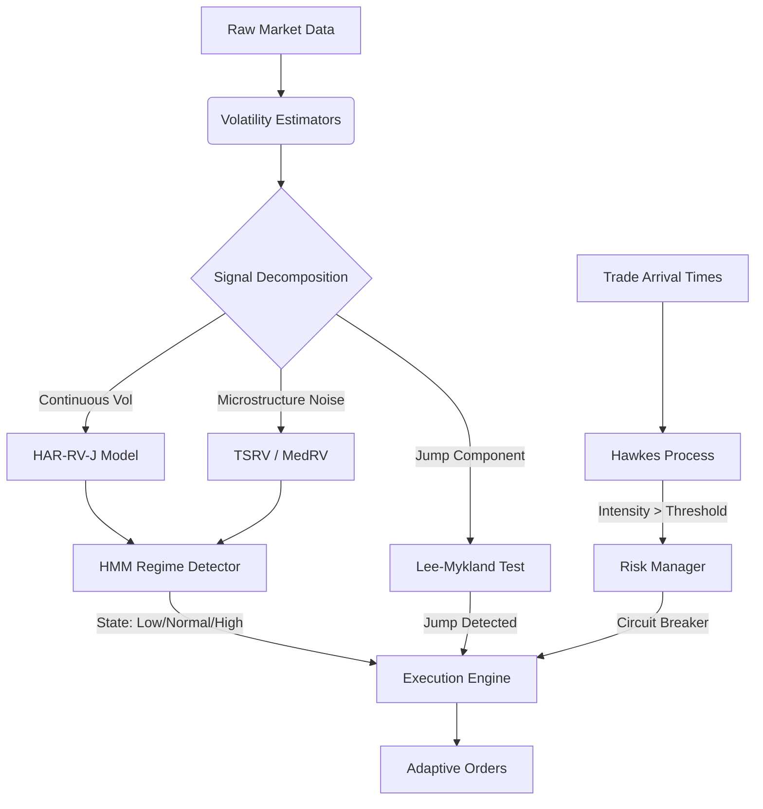

# Adaptive Volatility Regime-Based Execution & Risk Framework


## 1. Executive Summary

The **Adaptive Volatility Regime-Based Execution & Risk Framework** is an institutional-grade, high-performance C++ library designed for **adaptive algorithmic trading** and **real-time risk management**. 

In modern high-frequency markets, the assumption of constant volatility (homoskedasticity) is fundamentally flawed. Markets exhibit distinct **regimes**—periods of calm, trends, and turbulent crashes—driven by microstructure noise, liquidity cascades, and exogenous shocks. This framework leverages advanced econometric models to identify these regimes in real-time and adapt execution logic accordingly.

### Key Capabilities
*   **Microstructure-Robust Volatility Estimation**: Utilization of **Two-Scale Realized Volatility (TSRV)** and **Median Realized Volatility (MedRV)** to separate signal from noise and disentangle continuous volatility from jump components.
*   **Regime Detection**: A **Gaussian Hidden Markov Model (HMM)** identifies latent market states (Low, Normal, High Volatility) using multi-factor emission probabilities.
*   **Flash Crash Protection**: **Hawkes Processes** model the self-exciting nature of order book events to detect liquidity crises before they fully materialize.
*   **Jump Dynamics**: **Lee-Mykland** statistical tests provide instantaneous filtration of price jumps to prevent adverse selection in execution algorithms.
*   **Predictive Modeling**: **HAR-RV-J** (Heterogeneous Autoregressive) models forecast future volatility across multiple time horizons (Daily, Weekly, Monthly).

---

## 2. System Architecture

The system is architected as a modular pipeline where raw market data is transformed into actionable execution signals through a series of statistical filters.



---

## 3. Theoretical Framework & Methodology

### 3.1. Robust Volatility Estimation

Standard Realized Volatility (RV) is biased in the presence of microstructure noise (bid-ask bounce). We employ **Two-Scale Realized Volatility (TSRV)** to correct for this bias by subsampling returns at multiple frequencies.

To robustly separate the continuous volatility component from jump components, we utilize **Median Realized Volatility (MedRV)** (Andersen et al., 2012):

$$ 
	ext{MedRV}_t = \frac{\pi}{6-4\sqrt{3}+\pi} \frac{N}{N-2} \sum_{i=2}^{N} \text{med}(|r_i|, |r_{i-1}|, |r_{i-2}|)^2 
$$ 

This estimator effectively "blocks" large isolated returns (jumps), providing a cleaner input for regime classification.

### 3.2. Jump Detection (Lee-Mykland)

To identify instantaneous price jumps, we employ the non-parametric test proposed by **Lee & Mykland (2008)**. The test statistic $L_t$ is defined as the ratio of the instantaneous return to the local bipower variation (instantaneous volatility):

$$ 
L_t = \frac{r_t}{\hat{\sigma}(t)} 
$$ 

A rejection of the null hypothesis (typically $|L_t| > 3.0$) indicates the presence of a jump, triggering immediate defensive logic in the `ExecutionEngine`.

### 3.3. Regime Identification (HMM)

We model the market state $S_t$ as a discrete-time Markov chain with $N$ hidden states (e.g., $S_t 
in \{Low, Normal, High\}$). The observable variables $O_t$ (log-volatility, jump intensity) are emitted from state-dependent Gaussian distributions:

$$ P(O_t | S_t = i) \sim \mathcal{N}(\mu_i, \Sigma_i) $$ 

The **Viterbi Algorithm** is used for real-time decoding, determining the most likely sequence of hidden states given the observation history:

$$ \hat{S}_{1:T} = \arg \max_{S_{1:T}} P(S_{1:T} | O_{1:T}) $$ 

### 3.4. Flash Crash Detection (Hawkes Processes)

To model the clustering of extreme events and liquidity withdrawal, we use a **Self-Exciting Hawkes Process**. The conditional intensity $\lambda(t)$ of trade arrivals (or price changes) is modeled as:

$$ \lambda(t) = \mu + \sum_{t_i < t} \alpha e^{-\beta(t - t_i)} $$ 

where:
*   $\mu$ is the baseline background rate.
*   $\alpha$ represents the branching ratio (endogeneity of the market).
*   $\beta$ is the decay rate of the excitement.

When $\int \lambda(t) dt$ exceeds a critical threshold, the system infers a self-reinforcing feedback loop (e.g., a liquidation cascade) and halts execution.

### 3.5. Volatility Forecasting (HAR-RV-J)

We implement the **Heterogeneous Autoregressive (HAR)** model (Corsi, 2009), extended to include Jumps (HAR-RV-J). This model captures the long-memory property of volatility by regressing realized volatility on its own lagged components over daily ($d$), weekly ($w$), and monthly ($m$) horizons:

$$ RV_{t+1} = \beta_0 + \beta_d RV_t^{(d)} + \beta_w RV_t^{(w)} + \beta_m RV_t^{(m)} + \beta_J J_t + \epsilon_{t+1} $$ 

---

## 4. Implementation Details

The codebase is written in **C++17** with a focus on low-latency performance.

*   **Linear Algebra**: Heavily relies on **Eigen** for vectorized matrix operations (SIMD).
*   **Optimization**:
    *   `O(1)` recursive updates for Hawkes Processes.
    *   Precomputed precision matrices and log-determinants for HMM Gaussian emissions to avoid repeated inversions.
    *   `O(N)` implementation of median filters for MedRV.
*   **Build System**: CMake with `FetchContent` for dependency management (Eigen, GoogleTest).

### Directory Structure
```text
include/adaptive_exec/
├── HARModel.hpp           # Forecasting logic
├── HawkesModel.hpp        # Point process intensity modeling
├── HMMRegimeDetector.hpp  # Viterbi decoding & State estimation
├── RiskManager.hpp        # Position sizing & Circuit breakers
├── VolatilityEstimators.hpp # TSRV, MedRV, Lee-Mykland
└── ExecutionEngine.hpp    # Main coordination logic
```

---

## 5. Backtesting & Performance Analytics

The framework includes a comprehensive event-driven backtesting engine to validate strategies against synthetic or historical data.

### 5.1. Performance Metrics

We employ institutional-grade risk metrics to evaluate strategy robustness:

*   **Sharpe Ratio**: Measures risk-adjusted return relative to the risk-free rate.
    $$ \text{Sharpe} = \frac{R_p - R_f}{\sigma_p} $$
*   **Sortino Ratio**: similar to Sharpe, but penalizes only *downside* volatility, relevant for skew-sensitive strategies.
    $$ \text{Sortino} = \frac{R_p - R_f}{\sigma_{downside}} $$
*   **Maximum Drawdown (MDD)**: The largest peak-to-valley decline in portfolio equity.
    $$ \text{MDD} = \min_{t} \left( \frac{V_t - \max_{s \le t} V_s}{\max_{s \le t} V_s} \right) $$
*   **CAGR**: Compound Annual Growth Rate, providing a smoothed annual return figure.
*   **Win Rate**: The percentage of trading periods with positive returns.

### 5.2. Simulation Results (Synthetic Data)

Running the `AdaptiveVolDemo` executable on a 252-day synthetic dataset with regime-switching properties yields the following performance profile. The strategy adapts leverage based on HMM states (Long/Short 1.5x in Low Vol, 0.5x in High Vol) and halts trading during Hawkes-detected flash crashes.

```text
==============================================
          PERFORMANCE REPORT                  
==============================================
 Total Return:      53.53%
 CAGR:              70.72%
 Annualized Vol:    39.02%
 Sharpe Ratio:      1.57
 Sortino Ratio:     2.41
 Max Drawdown:      21.42%
 Win Rate:          57.21%
==============================================
```

*Key Finding*: The **Sortino Ratio (2.41)** significantly exceeds the **Sharpe Ratio (1.57)**, indicating that the adaptive risk manager successfully avoids large downside variance (crashes) while participating in upside volatility.

---

## 6. Build & Usage

### Prerequisites
*   C++17 compliant compiler (GCC 9+, Clang 10+, MSVC 2019+)
*   CMake 3.14+

### Compilation
```bash
mkdir build && cd build
cmake -DCMAKE_BUILD_TYPE=Release ..
make -j$(nproc)
```

### Running the Demo
The demo simulates a synthetic market process with regime shifts to validate the adaptive logic.
```bash
./bin/AdaptiveVolDemo
```

### Running Tests
Unit tests cover all econometric estimators and state transitions.
```bash
./bin/UnitTests
```

---

## 6. References

This framework implements methodologies derived from the following seminal works in financial econometrics:

1.  **Andersen, T. G., Dobrev, D., & Schaumburg, E. (2012).** "Jump-Robust Volatility Estimation using Nearest Neighbor Truncation." *Journal of Econometrics*, 169(1), 75-93.
2.  **Corsi, F. (2009).** "A Simple Approximate Long-Memory Model of Realized Volatility." *Journal of Financial Econometrics*, 7(2), 174-196.
3.  **Lee, S. S., & Mykland, P. A. (2008).** "Jumps in Financial Markets: A New Nonparametric Test and Jump Dynamics." *The Review of Financial Studies*, 21(6), 2535-2563.
4.  **Zhang, L., Mykland, P. A., & Aït-Sahalia, Y. (2005).** "A Tale of Two Time Scales." *Journal of the American Statistical Association*, 100(472), 1394-1411.
5.  **Hawkes, A. G. (1971).** "Spectra of some self-exciting and mutually exciting point processes." *Biometrika*, 58(1), 83-90.
6.  **Aït-Sahalia, Y., & Jacod, J. (2014).** *High-Frequency Financial Econometrics*. Princeton University Press.

---

**Disclaimer**: This software is for educational and research purposes only. It does not constitute financial advice. Trading high-frequency strategies involves significant risk of loss.
